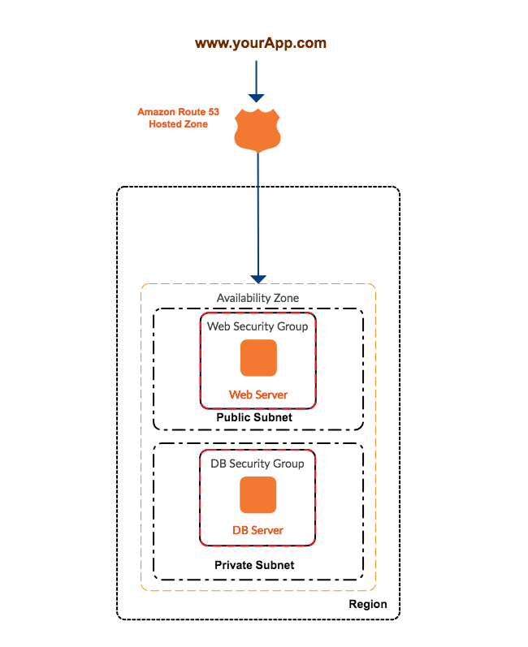

# Sparta-AWS-VPC

The following ReadME provides an explanation on how VPC(Virtual Private Clouds) work, their structure and the initiation of a VPC using AWS(Amazon Web Service).

## Technology used
* AWS
* VPC

## How to download
1. Search for Adnaan-m in GitHub. [Click Here](https://github.com/Adnaan-m/Sparta-AWS-VPC) for the link.
2. Search for the Sparta-AWS-VPC repository.
3. Download the ReadME file displayed.

## About VPC
VPC is a virtual private cloud promoting the functionality of machine rendering over a live server. Why VPC? VPC supplements the ease of many purposes including; Application performance, Security and Less baggage. 

Application Performance --> A pre-segemented position is available for the client with all the requirements to make a machine function with ease. Many would say internet traffic can cause processing errors in accordance to bandwidth availability. However, VPC's provide a segmented potition within the internet from which your machine is marked as high in priority and delivered accordingly.

Security -> Various firewalls are set up to prevent cyber attacks on a proposed system. Also, information is only passed through the corporate sector in appose to crossing the internet.

Less Baggage -> No servers, datacenters or bulk hardware needed, it is all provided with your supplier (in our case, AWS).

The following image displays the basic architecture of a VPC and how it is all configured. 

1. First of all, through a direct internet access gateway, connection to the server is created. From this, if successful with the gateway requirements the user can enter the VPN. However, if the criterion is not met, the firewalls border up and prevent access.
2. The image displays a two-tier architecture consisting of a web server (lets call this a website) and a DB server (e.g. MongoDB). 
3. The web server contains the architecture for the website which is the first to be accessed. Being a two-tier architecture, the VPN supports this by providing both tiers with differed subnets. 
4. As you can see, the web server includes a public subnet making it available to the public (within the firewalls ofcourse).
5. On the other hand, the MongoDB server supplies a private subnet from which noone apart from authorised personnel should ever attain the masked tier. How is this done? The DB server can only be accessed by the Web Server to extract relevant information. NO loop road can be taken from the access gateway straight the DB server making it a much secure environment.

### Bastion 
Relating to the previous point is the implementation of a bastion. A bastion promotes further security within a VPC, only allowing access through one server and acting as a proxxy for other instances.

## VPC Implementation Using AWS

1. Select services in the navbar at the top of the page.
2. Scroll down to the Networking & Content Delivery section and select VPC.
3. Select the blue '*Launch VPC Wizard*' button at the top of the page.
4. Select the VPC with the public and private subnets option on the left hand side of the page.
5. Select the blue '*select*' button in the middle of the page.
6. Create a name for the VPC in the second text box displayed.
7. Insert the relevant data for the '*Elastic IP Allocation ID*' column. An option to '*Use a NAT instance instead*' option is also displayed on the right of the page in line with the current field.
8. Finally create your VPC by clicking on the blue '*create VPC*' on the bottom right hand side of the page.

>**Created by: Adnaan Mamaniat!**